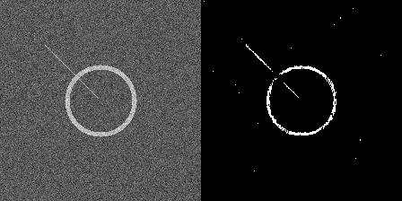

# Physics-Informed Wafer Defect Segmentation (U-Net)

## 📌 Project Overview
Automated defect inspection in semiconductor manufacturing is often bottlenecked by a lack of labeled pixel-wise data. This project implements a **Synthetic Data Engine** and a **U-Net Architecture** to segment yield-critical defects (Scratches, Donuts) on semiconductor wafer maps.

Unlike traditional supervised learning which relies on massive static datasets, this pipeline utilizes **Procedural Generation** to simulate defect morphologies based on physical process signatures (CMP Scratches, Deposition Thermal Gradients).

## 🚀 Key Features
* **Architecture:** Lightweight U-Net optimized for edge inference.
* **Infinite Training Loop:** Implemented **On-the-Fly Data Generation** to bypass disk I/O bottlenecks. The model trains on 100% unique synthetic samples every batch, eliminating overfitting.
* **Robustness:** Proven capability to segment defects even in high-noise environments (simulating low-contrast sensor scans).

## 📊 Results
The model successfully disentangles process defects from sensor noise:


*(Left: Noisy Input | Center: U-Net Prediction | Right: Overlay)*

## 🛠️ How to Run
1. **Install Dependencies:**
   ```bash
   pip install -r requirements.txt